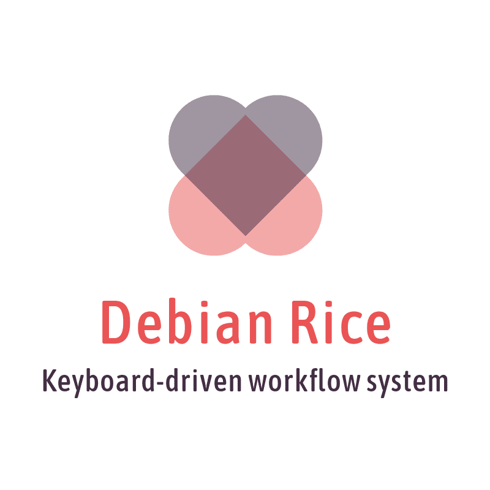

## Introduction

## Features // Demo in Action

## Installation

### Dependencies

### Cloning

## Usage

### Basic keyboard commands

## Contributing
(link to CONTRIBUTING.md)

## License

- **[MIT license](http://opensource.org/licenses/mit-license.php)**
- Copyright 2015 © <a href="https://github.com/feintgs" target="_blank">FeintGS</a>.
