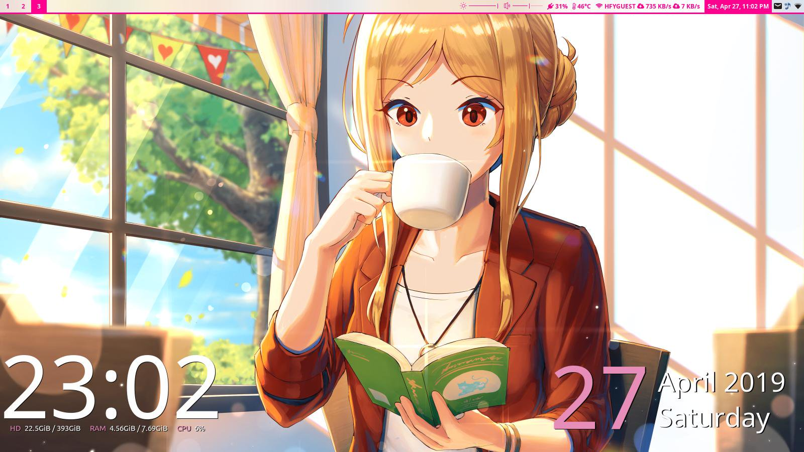

<h1 align="center">Debian Rice</h1>

	<strong>My collection of dotfiles for a perfect computing experience</strong>

  <h3>
    <a href="#Features">Features</a>
     | 
    <a href="#Usage-guide">Usage guide</a>
     | 
    <a href="#Installation">Installation</a>
     | 
    <a href="#Dependencies">Dependencies</a>
     | 
    <a href="#Contributing">Contributing</a>
     | 
    <a href="#License">License</a>
  </h3>

	Ambitious project with plans to evolve into its own standalone GNU/Linux distribution, Soon™

	

# Features

* Features a highly efficient and ergonomic workflow system, designed to eliminate unnecessary wrist-related movements and pain
* Designed *especially* with laptop users in mind
	* Vim-based bindings encourage fingers to stay on home row, and off the touchpad
	* Eliminates necessity of carrying additional peripherals (i.e. computer mice) for a productive computing experience
	* Prolongs laptop battery life, minimizing resource utilization
* Combines beautiful aesthetics with low hardware requirements

# Usage Guide

### Basic Controls

<strong>Workspace movement</strong>

	
| Keybinding | Action |
| :--------- | :----- |
<kbd>Super</kbd> + <kbd>0</kbd> - <kbd>9</kbd> | Focus workspace N
<kbd>Super</kbd> + <kbd>Shift</kbd> + <kbd>0</kbd> - <kbd>9</kbd> | Move to workspace N

<strong>Window movement</strong>

| Keybinding | Action |
| :--------- | :----- |
<kbd>Super</kbd> + <kbd>h</kbd> | Focus left window
<kbd>Super</kbd> + <kbd>j</kbd> | Focus down window
<kbd>Super</kbd> + <kbd>k</kbd> | Focus up window
<kbd>Super</kbd> + <kbd>l</kbd> | Focus right window
<kbd>Super</kbd> + <kbd>Shift</kbd> + <kbd>h</kbd> | Swap with window left (tiled) / Move window left (floating)
<kbd>Super</kbd> + <kbd>Shift</kbd> + <kbd>j</kbd> | Swap with window down (tiled) / Move window down (floating)
<kbd>Super</kbd> + <kbd>Shift</kbd> + <kbd>k</kbd> | Swap with window up (tiled) / Move window up (floating)
<kbd>Super</kbd> + <kbd>Shift</kbd> + <kbd>l</kbd> | Swap with window right (tiled) / Move window right (floating)

<strong>Manipulating the window state</strong>

| Keybinding | Action |
| :--------- | :----- |
<kbd>Super</kbd> + <kbd>q</kbd> | Kill focused window
<kbd>Super</kbd> + <kbd>Shift</kbd> + <kbd>q</kbd> | Kill focused window
<kbd>Super</kbd> + <kbd>Spacebar</kbd> | Toggle floating on/off state for currently focused window
<kbd>Super</kbd> + <kbd>Shift</kbd> + <kbd>Spacebar</kbd> | Toggle sticky on/off state for currently focused window

### Window Border Margin (i.e. "Window Gaps") Sizing Adjustment

<strong>Inner gaps only</strong>

	
| Keybinding | Action |
| :--------- | :----- |
<kbd>Ctrl</kbd> + <kbd>Super</kbd> + <kbd>0</kbd> | Reset to default inner gaps size
<kbd>Ctrl</kbd> + <kbd>Super</kbd> + <kbd>-</kbd> | Shrink windows
<kbd>Ctrl</kbd> + <kbd>Super</kbd> + <kbd>=</kbd> | Enlarge windows
<kbd>Ctrl</kbd> + <kbd>Super</kbd> + <kbd>Backspace</kbd> | Zero pixel inner gaps

<strong>Outer gaps only</strong>

	
| Keybinding | Action |
| :--------- | :----- |
<kbd>Super</kbd> + <kbd>Alt</kbd> + <kbd>0</kbd> | Reset to default outer gaps size
<kbd>Super</kbd> + <kbd>Alt</kbd> + <kbd>-</kbd> | Shrink windows
<kbd>Super</kbd> + <kbd>Alt</kbd> + <kbd>=</kbd> | Enlarge windows
<kbd>Super</kbd> + <kbd>Alt</kbd> + <kbd>Backspace</kbd> | Zero pixel outer gaps

<strong>Both inner and outer gaps</strong>

| Keybinding | Action |
| :--------- | :----- |
<kbd>Ctrl</kbd> + <kbd>Super</kbd> + <kbd>Alt</kbd> + <kbd>0</kbd> | Reset to default inner+outer gaps size
<kbd>Ctrl</kbd> + <kbd>Super</kbd> + <kbd>Alt</kbd> + <kbd>-</kbd> | Shrink windows
<kbd>Ctrl</kbd> + <kbd>Super</kbd> + <kbd>Alt</kbd> + <kbd>=</kbd> | Enlarge windows
<kbd>Ctrl</kbd> + <kbd>Super</kbd> + <kbd>Alt</kbd> + <kbd>Backspace</kbd> | Zero pixel inner+outer gaps

### Applications

<strong>Pop-up utility programs</strong>

	
| Keybinding | Action |
| :--------- | :----- |
<kbd>Super</kbd> + <kbd>a</kbd> | Qalc calculator
<kbd>Super</kbd> + <kbd>e</kbd> | Mozilla Thunderbird email client
<kbd>Super</kbd> + <kbd>u</kbd> | Tmux terminal
<kbd>Super</kbd> + <kbd>m</kbd> | GNOME Music Player Daemon client
<kbd>Super</kbd> + <kbd>f</kbd> | GNOME Nautilus file manager
<kbd>Super</kbd> + <kbd>t</kbd> | GNOME Resource Monitor

<strong>Rofi Dmenu</strong>

| Keybinding | Action |
| :--------- | :----- |
| <kbd>Super</kbd> + <kbd>d</kbd> | Launch new app instance |
| <kbd>Super</kbd> + <kbd>i</kbd> | Insert emoji |
| <kbd>Super</kbd> + <kbd>o</kbd> | Insert unicode symbol |

# Dependencies
| Debian Package | Description | Upstream |
| :------------- | :---------- | :------- |
| [Rofi](https://packages.debian.org/buster/rofi) | A window switcher, Application launcher and dmenu replacement | https://github.com/davatorium/rofi |
| [i3-wm](https://packages.debian.org/buster/i3-wm) | Improved dynamic tiling window manager | https://github.com/i3/i3 |
| Polybar | A fast and easy-to-use tool for creating status bars. | https://github.com/jaagr/polybar |
| [Conky](https://packages.debian.org/buster/conky-all) | Conky is a free, light-weight system monitor for X, that displays any kind of information on your desktop. | https://github.com/brndnmtthws/conky
| [mpd](https://packages.debian.org/buster/mpd) | Music Player Daemon | https://github.com/MusicPlayerDaemon/MPD |
| [dunst](https://packages.debian.org/buster/dunst) | Lightweight and customizable notification daemon | https://github.com/dunst-project/dunst |
| [qalculate](https://packages.debian.org/buster/qalculate) | Powerful and easy to use desktop calculator | https://qalculate.github.io/ |
| [Chromium](https://packages.debian.org/buster/chromium) | Web browser that aims to build a safer, faster, and more stable internet browsing experience. | https://chromium.googlesource.com/chromium/src.git |
| [feh](https://packages.debian.org/buster/feh) | imlib2 based image viewer | https://git.finalrewind.org/feh |
| [compton](https://packages.debian.org/buster/compton) | compositor for X11, based on xcompmgr | https://github.com/chjj/compton |
| [gmpc](https://packages.debian.org/buster/gmpc) | GNOME Music Player Client (graphical interface to MPD) | https://gmpclient.org/ |
| [nautilus](https://packages.debian.org/buster/nautilus) | File manager and graphical shell for GNOME | https://gitlab.gnome.org/GNOME/Nautilus |
| [mpv](https://packages.debian.org/buster/mpv) | Video player based on MPlayer/mplayer2 | https://github.com/mpv-player/mpv |
